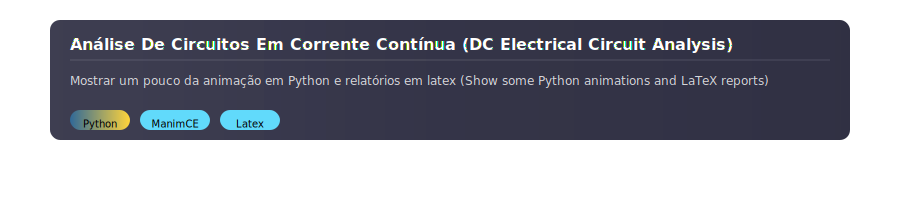

<p align="center">
  
</p>


---

# **`Análise De Circuitos Em Corrente Contínua (DC Electrical Circuit Analysis)`**

>[!IMPORTANT]
> Este repositório tem como foco principal armazenar os relatórios produzidos na disciplina **Análise de Circuitos em Corrente Contínua**, ministrada pelo professor **João Cesar Paula Salve**. Todos os relatórios foram elaborados utilizando `LaTeX` (compilados no `Overleaf`), o simulador de circuitos `Falstad` e, em alguns casos, gráficos gerados em `Python`, por meio da biblioteca `matplotlib`. Além disso, este repositório também armazena o código da apresentação final da disciplina, desenvolvida em `Python` utilizando a biblioteca `ManimCE`. O vídeo completo da apresentação pode ser acessado no seguinte link:  
[Vídeo da Apresentação Completa](https://www.youtube.com/watch?v=DIhBOLY_waU)

---

>[!IMPORTANT]
> This repository is primarily intended to store the reports produced for the course **DC Electrical Circuit Analysis**, taught by Professor **João Cesar Paula Salve**. All reports were created using `LaTeX` (compiled on `Overleaf`), the circuit simulator `Falstad`, and, in some cases, graphics generated in `Python` through the `matplotlib` library. Additionally, this repository also stores the code for the final presentation of the course, developed in `Python` using the `ManimCE` library. The full presentation video can be accessed at the link below:  
[Full Presentation Video](https://www.youtube.com/watch?v=DIhBOLY_waU)


---

## 📂 Estrutura do Repositório (Repository Structure)

<details>
  <summary><b>Abrir para visualizar (Open to view)</b></summary>

```text
├── Laboratory-Reports
│   ├── Report1.pdf
│   ├── Report2.pdf
│   ├── Report3.pdf
│   ├── Report4.pdf
│   └── Report5.pdf
├── Presentation
│   ├── circuitoInicial.py
│   └── graficoTensao.py
└── README.md

```

 </details>

---

## Sobre a Apresentação usando ManimCE

<details>

<summary><b>Construção do Código</b></summary>

Para o desenvolvimento do código, foi utilizada a 
[Documentação Oficial do Manim](https://docs.manim.community/en/stable/reference/manim.animation.animation.Animation.html).  
A construção do circuito foi realizada com o auxílio da biblioteca adequada e da aplicação web 
[TikZMaker](https://tikzmaker.com/editor).

Durante o desenvolvimento da plotagem do gráfico e da construção/animação do circuito, utilizaram-se como inspiração os seguintes recursos:

- [Electrical Circuit Representation with ManimCE and LaTex || ManimCE || Python](https://www.youtube.com/watch?v=sWSmd3cujK8&pp=ygUQbWFuaW0gY2UgY2lyY3VpdA%3D%3D)
- [Design, Simulate & Animate Electrical Circuits with Python](https://www.youtube.com/watch?v=Ckownv7VoxM&pp=ygUQbWFuaW0gY2UgY2lyY3VpdA%3D%3D)
- [1.1 Manim tutorial: Creating Graphs](https://www.youtube.com/watch?v=GemuXCUEBVU&t=410s)
- [Código de referência no GitHub 1](https://github.com/sayedul79/m-anim/blob/main/colored-circuit.py)
- [Código de referência no GitHub 2](https://github.com/yasser64b/Animations)


Cada trecho do vídeo foi gerado a partir de uma parcela do código. Depois que tudo ficou pronto, foi usado o [Adobe Express](https://new.express.adobe.com/home/tools/merge-videos) para concatenar os vídeos.


> Na pasta ```Presentation/``` do respositório, vão estar somente as partes principais.


Todo o código foi executado no Ubuntu 24.04.3 LTS por meio do terminal. Existem diversas alternativas, como utilizar o Google Colab, porém aqui foi adotado o Vim juntamente com o terminal padrão do sistema.

</details>

<details>
  <summary><b>Instruções de Instalação e Execução do ManimCE</b></summary>

## 1. Instalação

A instalação foi realizada de acordo com a documentação oficial do Manim. No caso do Linux, bastou seguir as instruções específicas:

**Documentação:**  
[Instalação do Manim](https://docs.manim.community/en/stable/installation/uv.html)

```bash
sudo apt update
sudo apt install texlive-full build-essential python3-dev libcairo2-dev libpango1.0-dev
```

## 2. Criação e ativação do ambiente virtual Python

O uso de ambientes virtuais é uma prática padrão para executar programas em Python. Mais informações podem ser encontradas na [Documentação do módulo venv](https://docs.python.org/pt-br/3/library/venv.html).

```bash
python3 -m venv teste
source teste/bin/activate
```

## 3. Instalação da biblioteca dentro do ambiente virtual

Com o ambiente virtual ativado, atualize o `pip` e instale o Manim:

```bash
pip install --upgrade pip
pip install manim
```

## 4. Abrir ou editar os arquivos de código do repositório

Você pode abrir os arquivos Python do repositório em um editor de texto, como o Vim:

```bash
vim *.py
```

## 5. Executar a animação

Com o ambiente virtual ativado e o arquivo Python pronto, execute a animação com o seguinte comando:

```bash
python -m manim -pqh *.py <nomeClasse>
```

> No Youtube, tem uma breve execução do passo a passo: [Instruções simples sobre executar ManimCE pelo terminal](https://youtu.be/dnqXJ8WkLio)

</details>

---


## About the Presentation using ManimCE

<details>

<summary><b>Code Development</b></summary>

For code development, the 
[Official Manim Documentation](https://docs.manim.community/en/stable/reference/manim.animation.animation.Animation.html) was used.  
The circuit construction was carried out with the help of the appropriate library and the web application 
[TikZMaker](https://tikzmaker.com/editor).

During the development of the graph plotting and circuit construction/animation, the following resources were used as inspiration:

- [Electrical Circuit Representation with ManimCE and LaTex || ManimCE || Python](https://www.youtube.com/watch?v=sWSmd3cujK8&pp=ygUQbWFuaW0gY2UgY2lyY3VpdA%3D%3D)
- [Design, Simulate & Animate Electrical Circuits with Python](https://www.youtube.com/watch?v=Ckownv7VoxM&pp=ygUQbWFuaW0gY2UgY2lyY3VpdA%3D%3D)
- [1.1 Manim tutorial: Creating Graphs](https://www.youtube.com/watch?v=GemuXCUEBVU&t=410s)
- [Reference Code on GitHub 1](https://github.com/sayedul79/m-anim/blob/main/colored-circuit.py)
- [Reference Code on GitHub 2](https://github.com/yasser64b/Animations)

Each video segment was generated from a portion of the code. After everything was ready, [Adobe Express](https://new.express.adobe.com/home/tools/merge-videos) was used to concatenate the videos.


> In the ```Presentation/``` folder of the repository, only the main parts will be available.

All code was executed on Ubuntu 24.04.3 LTS via the terminal. There are several alternatives, such as using Google Colab, but here Vim was adopted along with the system's default terminal.

</details>

<details>
<summary><b>ManimCE Installation and Execution Instructions</b></summary>

## 1. Installation

Installation was performed according to the official Manim documentation. In the case of Linux, it was sufficient to follow the specific instructions:

**Documentation:**  
[Manim Installation](https://docs.manim.community/en/stable/installation/uv.html)

```bash
sudo apt update
sudo apt install texlive-full build-essential python3-dev libcairo2-dev libpango1.0-dev
```

## 2. Creation and activation of the Python virtual environment

The use of virtual environments is a standard practice for running Python programs. More information can be found in the [venv module documentation](https://docs.python.org/3/library/venv.html).

```bash
python3 -m venv teste
source teste/bin/activate
```

## 3. Library installation within the virtual environment

With the virtual environment activated, update `pip` and install Manim:

```bash
pip install --upgrade pip
pip install manim
```

## 4. Open or edit the repository code files

You can open the Python files from the repository in a text editor, such as Vim:

```bash
vim *.py
```

## 5. Run the animation

With the virtual environment activated and the Python file ready, execute the animation with the following command:

```bash
python -m manim -pqh *.py <ClassName>
```

> On YouTube, there's a brief demonstration of the step-by-step process: [Simple instructions for running ManimCE via terminal](https://youtu.be/dnqXJ8WkLio)

</details>




---

## Repositório Recomendado (Recommended Repository)

<p align="center">
  <a href="https://github.com/fuyuakii/Data-Structures">
    
  </a>
</p>


---

<p align="center">
  <table align="center">
    <tr>
      <td></td>
      <td></td>
    </tr>
  </table>
</p>

---


<p align="center">
  
</p>
